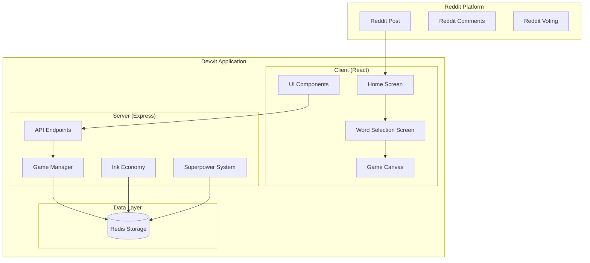

# Design Document

## Overview

Drawwit is an asynchronous pixel art battle game built on Reddit's Devvit platform. The game transforms Reddit posts into creative arenas where users compete in faction-based drawing battles. The design emphasizes a retro pixel art aesthetic with a grid-based visual theme that reflects the core drawing mechanics.

The application follows a client-server architecture where the React client handles user interactions and canvas rendering, while the Express server manages game state, Reddit integration, and data persistence through Redis.

## Architecture

### System Architecture



### Component Architecture

The application is structured as a monorepo with clear separation between client, server, and shared code:

- **Client**: React-based UI with pixel art aesthetic and grid-based layout
- **Server**: Express API handling game logic, Reddit integration, and data persistence
- **Shared**: TypeScript interfaces and types for type safety across the application

## Components and Interfaces

### Client Components

#### Home Screen Component
Based on the provided design, the home screen features:
- **Grid Background**: Pixel art aesthetic with colored grid squares scattered throughout
- **Game Title**: "Drawwit" prominently displayed in pixel font style
- **Primary Actions**:
  - "Create Match" button (primary action)
  - "Shop" button (secondary feature)
  - "How to Play" button (informational)
- **Visual Design**: Purple/black color scheme with rounded rectangular buttons
- **Layout**: Centered vertical layout optimized for both mobile and desktop

```typescript
interface HomeScreenProps {
  onCreateMatch: () => void; // Callback when user clicks "Create Match" button
  onOpenShop: () => void; // Callback when user clicks "Shop" button
  onShowTutorial: () => void; // Callback when user clicks "How to Play" button
}
```

#### Word Selection Screen Component
The word selection interface provides two modes:
- **Random Words Mode**: 
  - Displays a randomly generated word (e.g., "Elephant")
  - "Change Word" button to generate new random words
  - Highlighted with dashed border when selected
- **Custom Words Mode**:
  - Text input field for custom word entry
  - Content moderation warning
  - Alternative selection when random words aren't suitable
- **Navigation**: "Done!" button to proceed to game canvas
- **State Management**: Tracks selected mode and current word

```typescript
interface WordSelectionProps {
  onWordSelected: (word: string, isCustom: boolean) => void; // Callback when user confirms word selection
  onBack: () => void; // Callback to return to previous screen
}

interface WordSelectionState {
  selectedMode: 'random' | 'custom'; // Which word selection mode is currently active
  currentWord: string; // The currently displayed random word
  customWord: string; // User's custom word input
}
```

#### Game Canvas Component
The main drawing interface featuring:
- **Dual Canvas System**: Two 100×100 pixel canvases (Drawing A and Drawing B)
- **Drawing Tools**: Color palette, brush controls, zoom functionality
- **Faction Assignment**: Automatic assignment based on first canvas interaction
- **Real-time Updates**: Asynchronous state fetching from Redis

```typescript
interface GameCanvasProps {
  matchId: string; // Unique identifier for the current match
  word: string; // The word players are drawing
  playerInk: number; // Current player's available Ink balance
  onPixelPlace: (canvas: 'A' | 'B', x: number, y: number, color: string) => void; // Callback for pixel placement
}
```

#### UI Components
- **Ink Display**: Visual ink bar showing current balance
- **Timer Component**: Countdown display for match duration
- **Superpower Panel**: Grid of available powers with costs
- **Leaderboard**: Top collaborators for each faction
- **Vote Interface**: Custom voting buttons integrated with Reddit's system

### Server Components

#### API Endpoints
All endpoints follow the `/api/` prefix requirement and are designed for simple, single-action operations. The match ID (derived from Reddit post ID) is fundamental to all Redis operations.

##### Reddit Native Endpoints
These endpoints handle Reddit platform integration and native Reddit functions:

```typescript
// Reddit User Management
GET /api/getplayerusername          // Retrieves current Reddit user's username
GET /api/getplayerid               // Retrieves current Reddit user's unique ID

// Reddit Post Management  
POST /api/createpost               // Creates a new Reddit post for a match
GET /api/getpostid                 // Gets the current post's ID (used as match ID)


```

##### Drawwit Game Endpoints  
These endpoints handle game-specific data stored in Redis using the match ID:

```typescript

// Reddit Voting Integration
POST /api/upvotecanvas            // Handles upvoting a specific canvasA
POST /api/downvotecanvas          // Handles downvoting a specific canvasA
GET /api/getvotecounts            // Retrieves current vote counts for both canvases

// Match Data Management
POST /api/creatematch             // Initializes match data in Redis
GET /api/getmatchdata             // Retrieves complete match state from Redis
GET /api/getcanvasdata            // Retrieves pixel data for both canvases
POST /api/setmatchstatus          // Updates match status (active/expired/archived)

// Pixel Drawing Operations
POST /api/placepixel              // Places a single pixel on specified canvasA
GET /api/getpixelcolor            // Retrieves color of specific pixel coordinates
POST /api/updatecanvas            // Updates entire canvasA data in Redis

// Player Ink Management
GET /api/getplayerink             // Retrieves player's current ink balance
POST /api/addink                  // Adds ink to player's balance
POST /api/subtractink             // Subtracts ink from player's balance

// Faction Management
POST /api/assignfaction           // Assigns player to faction A or B
GET /api/getplayerfaction         // Retrieves player's current faction
GET /api/getfactiondata           // Retrieves all players in both factions
POST /api/updatefactionstats      // Updates faction statistics

// Superpower System
POST /api/purchasesuperpower      // Purchases a specific superpower for player
POST /api/activatesuperpower      // Activates a superpower on specified canvasA
GET /api/getplayersuperpowers     // Retrieves player's superpower inventory

// Leaderboard and Statistics
GET /api/gettopcolaborators       // Retrieves ordered list of top contributors
POST /api/updateplayerstats       // Updates player's match-specific statistics
GET /api/getmatchleaderboard      // Retrieves complete match leaderboard data

// Match Timer and Lifecycle
GET /api/getmatchtimeleft         // Retrieves remaining time for current match
POST /api/endmatch                // Manually ends a match and calculates results
GET /api/getmatchresults          // Retrieves final results of completed match
```

#### Game Manager
Central service handling:
- Match lifecycle management
- Canvas state synchronization
- Faction assignment logic
- Timer and expiration handling

```typescript
interface GameManager {
  // Redis Operations (using match ID from Reddit post ID)
  createMatchInRedis(matchId: string, prompt: string, duration: number): Promise<void>; // Initializes match data in Redis
  getMatchFromRedis(matchId: string): Promise<Match>; // Retrieves match data from Redis
  updateCanvasInRedis(matchId: string, canvas: 'A' | 'B', pixels: string[][]): Promise<void>; // Updates canvasA in Redis
  
  // Single-Action Operations
  placePixel(matchId: string, canvas: 'A' | 'B', x: number, y: number, color: string): Promise<void>; // Places single pixel
  assignPlayerToFaction(matchId: string, playerId: string, canvas: 'A' | 'B'): Promise<void>; // Assigns player to faction
  updatePlayerStats(matchId: string, playerId: string, inkSpent: number): Promise<void>; // Updates player match stats
}
```

#### Ink Economy Service
Manages the game's resource system:
- Initial balance allocation
- Transaction processing (pixel placement, voting rewards)
- Hourly reward distribution
- Superpower cost deduction

```typescript
interface InkEconomy {
  getPlayerBalance(playerId: string): Promise<number>; // Retrieves player's current Ink balance
  spendInk(playerId: string, amount: number): Promise<boolean>; // Deducts Ink from player's balance, returns success status
  awardInk(playerId: string, amount: number): Promise<void>; // Adds Ink to player's balance
  processPixelPlacement(playerId: string): Promise<void>; // Handles pixel placement transaction (-1 Ink, +0.5 Ink back)
}
```

## Data Models

### Match Model
```typescript
interface Match {
  id: string; // Unique identifier for the match
  prompt: string; // The word or phrase players need to draw
  canvasA: PixelCanvas; // First faction's drawing canvasA
  canvasB: PixelCanvas; // Second faction's drawing canvasA
  createdAt: Date; // Timestamp when the match was created
  expiresAt: Date; // Timestamp when the match ends
  status: 'active' | 'expired' | 'archived'; // Current state of the match
  votesA: number; // Total votes for canvasA A
  votesB: number; // Total votes for canvasA B
  factionA: PlayerMatchInfo[]; // List of PlayerMatchInfo for all players in faction A
  factionB: PlayerMatchInfo[]; // List of PlayerMatchInfo for all players in faction B
  topCollaborators: PlayerMatchInfo[]; // Ordered list of PlayerMatchInfo by contribution (index 0 = #1 player)
  totalInkSpentOnFactionA: number; // Total Ink spent on faction A
  totalInkSpentOnFactionB: number; // Total Ink spent on faction B
}
```

### Player Models

#### Player General Info
```typescript
interface PlayerGeneralInfo {
  redditUsername: string; // Player's Reddit username
  inkBalance: number; // Current amount of Ink available to spend
  superpowers: Record<string, number>; // Object containing each superpower type and quantity owned
}
```

#### Player Match Info
```typescript
interface PlayerMatchInfo {
  redditUsername: string; // Player's Reddit username for display
  faction: 'A' | 'B'; // Which faction the player is assigned to in this match
  inkSpentOnMatch: number; // Total Ink spent by this player in this specific match
}
```


### Canvas Model
```typescript
interface PixelCanvas {
  width: 100; // canvasA width in pixels (fixed at 100)
  height: 100; // canvasA height in pixels (fixed at 100)
  pixels: string[][]; // 2D array of color values [x][y] representing each pixel's color
}
```

## Error Handling

### Client-Side Error Handling
- **Network Failures**: Retry logic with exponential backoff for API calls
- **Invalid Actions**: Immediate feedback for insufficient ink or invalid pixel placement
- **State Synchronization**: Automatic refresh when local state becomes stale
- **User Input Validation**: Real-time validation for custom words and drawing actions

### Server-Side Error Handling
- **Redis Connection Issues**: Graceful degradation with retry mechanisms
- **Concurrent Modifications**: Optimistic locking for pixel placement conflicts
- **Rate Limiting**: Prevent spam through ink economy and cooldown systems
- **Data Validation**: Comprehensive input sanitization for all API endpoints

### Error Recovery Strategies
- **Match State Recovery**: Rebuild from Redis data on server restart
- **Player Progress Protection**: Atomic transactions for ink spending and pixel placement
- **Graceful Degradation**: Continue core functionality even if secondary features fail

## Testing Strategy

### Unit Testing
- **Component Testing**: React components with Jest and React Testing Library
- **Service Testing**: Game logic and ink economy with isolated unit tests
- **API Testing**: Express endpoints with supertest and mock Redis
- **Utility Testing**: Shared functions and type validation

### Integration Testing
- **Client-Server Communication**: End-to-end API interaction testing
- **Redis Integration**: Data persistence and retrieval workflows
- **Match Lifecycle**: Complete match creation to resolution testing
- **Concurrent User Scenarios**: Multi-player interaction simulation

### Performance Testing
- **Canvas Rendering**: Large pixel array rendering performance
- **Redis Query Optimization**: Match state retrieval under load
- **API Response Times**: Sub-200ms response time validation
- **Memory Usage**: Client-side memory management for large canvases

### Platform-Specific Testing
- **Devvit Integration**: Reddit post creation and interaction testing
- **Mobile Responsiveness**: Touch interaction and responsive layout testing
- **Cross-Browser Compatibility**: Canvas rendering across different browsers

## Design Decisions and Rationales

### Visual Design Choices
- **Pixel Art Aesthetic**: Reinforces the drawing theme and creates visual consistency between UI and game content
- **Grid Background**: Subtle reference to pixel placement mechanics while maintaining readability
- **Purple/Black Color Scheme**: Provides strong contrast and modern gaming aesthetic
- **Rounded Rectangles**: Softens the pixel art theme for better user experience

### Architecture Decisions
- **Asynchronous Updates**: Chosen over real-time WebSockets due to Devvit platform limitations and to reduce server complexity
- **Redis-Centric State**: Single source of truth approach simplifies data consistency and enables horizontal scaling
- **Faction Auto-Assignment**: Reduces friction by eliminating explicit team selection while maintaining competitive balance
- **Ink Economy**: Creates meaningful resource management without requiring external payments or complex progression systems

### User Experience Decisions
- **Two-Mode Word Selection**: Balances creative freedom with content moderation needs
- **Visual Ink Display**: Makes resource management transparent and engaging
- **Immediate Pixel Feedback**: Provides satisfying interaction despite asynchronous architecture
- **Integrated Voting**: Leverages familiar Reddit mechanics while maintaining game-specific functionality

### Technical Decisions
- **Monorepo Structure**: Enables shared types and simplified deployment while maintaining clear separation of concerns
- **Express Server**: Provides familiar Node.js environment with robust middleware ecosystem
- **React Client**: Enables complex UI interactions and efficient canvas rendering
- **TypeScript Throughout**: Ensures type safety across client-server boundaries and reduces runtime errors
